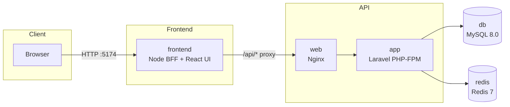

# PetCare Companion — Monorepo

A lightweight, educational monorepo demonstrating a Laravel API, a React UI, and a Node-based BFF (Backend for Frontend), containerized with Docker Compose.

## Overview

- Purpose: Showcase clean API design, a simple BFF layer, and a modern UI.
- Audience: Developers exploring Laravel + Vite/React with Docker.
- Scope: Non-production, minimal footprint, no secrets committed.

## Services

- api: Laravel 12 application (path: `src/`), served behind Nginx.
- web: Nginx reverse proxy for the Laravel API (port 8080 → 80 in container).
- frontend: Node Express BFF serving the built React UI and proxying `/api/*` to `web`.
- db: MySQL 8.0 with persistent volume.
- redis: Redis 7 for cache/queue experimentation.

## Repository Map

## Quick Start (Development)

- Copy env: `cp .env.example .env`
- Start dev stack: `docker compose -f docker-compose.dev.yml up`
- Migrate + seed: `docker compose -f docker-compose.dev.yml exec app php artisan migrate && docker compose -f docker-compose.dev.yml exec app php artisan db:seed`

## Ports

- API: `http://localhost:8080`
- Frontend: `http://localhost:5174`
- MySQL: `localhost:3307`
- Redis: `localhost:6379`

## Dev Notes

- Laravel commands: `docker-compose exec app php artisan <cmd>`
- BFF env: `SERVER_PORT`, `BACKEND_URL`, `SESSION_SECRET`, `COOKIE_SECURE`, `COOKIE_SAMESITE`

### Dev Compose (Single Stack)

- Use `docker-compose.dev.yml` for development. It includes: Laravel (app), Nginx (web), MySQL (db), Redis (redis), Queue worker, Scheduler, BFF (frontend), and Vite UI (frontend-ui) with live reload.
- BFF (Express): http://localhost:5174
- UI (Vite HMR): http://localhost:5173
- API (Nginx → PHP-FPM): http://localhost:8080

## Auth & Cookies

- Flow: The BFF completes OTP login with Laravel, stores the returned Sanctum token in a server-side session, and injects `Authorization: Bearer <token>` on proxied API requests. The browser never sees the token.
- CSRF: The BFF issues a CSRF token and requires it for mutating `/api/*` requests. Laravel API routes use stateless token auth; no double-CSRF required.
- Logout: `POST /auth/logout` clears the session/cookies and revokes the current Sanctum token in Laravel.
- Cookies: In production set `COOKIE_SECURE=true` and choose `COOKIE_SAMESITE=lax` (or `strict`) in `src/server/.env`.

## Production Compose (Reference)

- `docker-compose.yml` is production-oriented and references prebuilt images (no bind mounts). DB/Redis are expected to be external; set connection variables in `.env`.
- Not used during development; build/publish images before using it.

- Expose only the `frontend` service (Node BFF + static UI). Laravel (`web` + `app`) remains internal. The BFF proxies `/api/*` to Laravel via the Docker network.

## Documentation

- API (Laravel): `src/README.md`
- BFF Server: `src/server/README.md`
- UI (Vite + React): `src/ui/README.md`
- Architecture: `docs/architecture.md`
- Postman: `src/storage/app/private/scribe/collection.json`

## CI

- UI image build/push: `.github/workflows/ui.yml` (pushes to GHCR)
