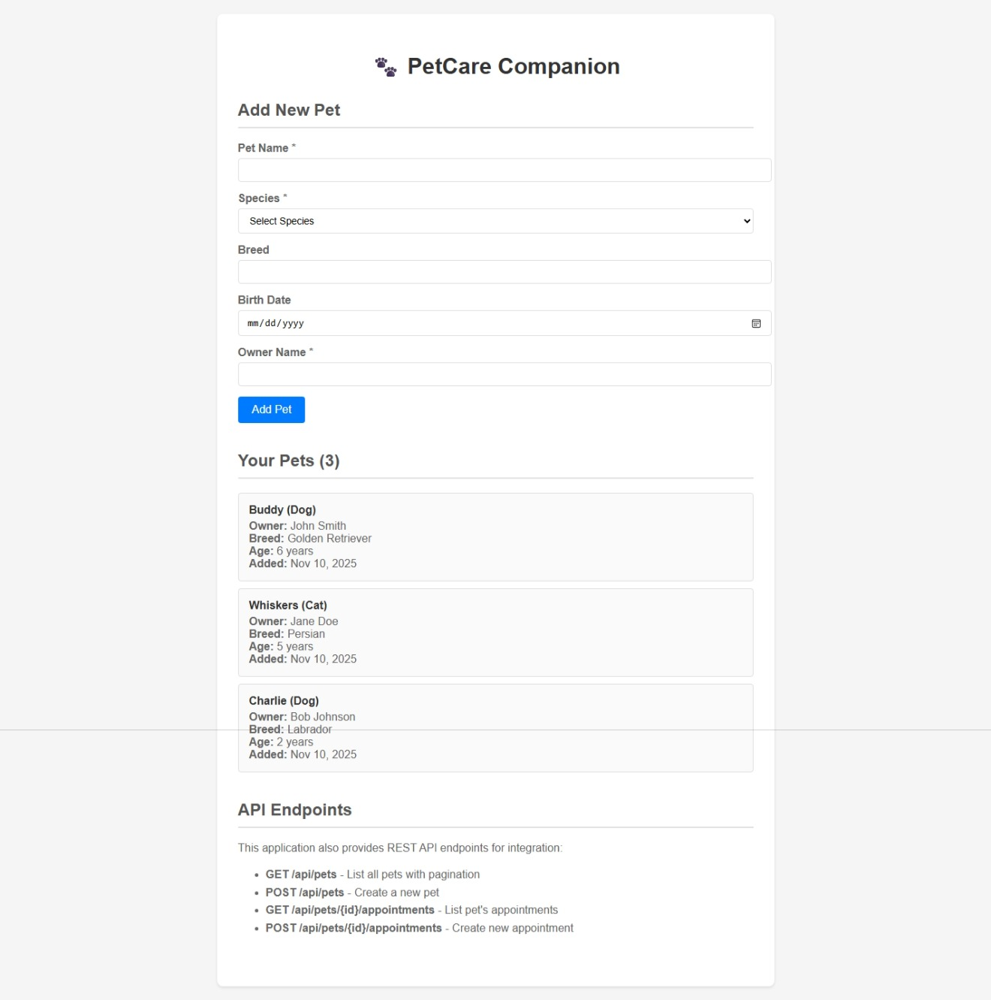

# 🐾 PetCare Companion

A modern **Laravel 11 REST API** for pet and appointment management, demonstrating **MVC architecture**, **Docker containerization**, and **comprehensive API design** best practices.

## 🎯 Purpose & Role Alignment

**Technology Stack**: PHP 8.3 • Laravel 11 • MySQL 8.0 • Docker • PHPUnit  
**Architecture**: RESTful API following MVC pattern with resource-based endpoints  
**Role**: Educational demonstration of modern Laravel development practices  

This project showcases:

- ✅ **REST API Design** - Resource controllers, API resources, pagination
- ✅ **Laravel Best Practices** - Form requests, Eloquent models, factories
- ✅ **Docker Integration** - Multi-container setup with app, database, and web services
- ✅ **Comprehensive Testing** - 46+ tests with 400+ assertions
- ✅ **Modern PHP** - PSR-12 standards, typed properties, dependency injection

## 🚀 Quick Start

### Prerequisites

- Docker & Docker Compose
- Git

### Setup (3 minutes)

```bash
# 1. Clone repository
git clone <repository-url>
cd petcare-companion

# 2. Start containers
docker-compose up -d

# 3. Run migrations and seeders
docker-compose exec app php artisan migrate
docker-compose exec app php artisan db:seed

# 4. Run tests to verify
docker-compose exec app php artisan test

# 5. Access application
# API: http://localhost:8080/api/pets
# Web UI: http://localhost:8080/pets
```

**That's it!** 🎉 You now have a fully functional API with demo data.

## 📊 API Endpoints Summary

| Method | Endpoint | Description | Features |
|--------|----------|-------------|----------|
| `GET` | `/api/pets` | List all pets | Pagination, filtering, sorting |
| `POST` | `/api/pets` | Create new pet | Validation, error handling |
| `GET` | `/api/pets/{id}` | Show single pet | Include appointments |
| `PUT` | `/api/pets/{id}` | Update pet | Full validation |
| `DELETE` | `/api/pets/{id}` | Delete pet | Soft delete support |
| `GET` | `/api/pets/{id}/appointments` | List pet's appointments | Advanced filtering |
| `POST` | `/api/appointments` | Create appointment | Pet association |
| `GET` | `/api/appointments/{id}` | Show appointment | Include pet data |
| `PUT` | `/api/appointments/{id}` | Update appointment | Status management |
| `DELETE` | `/api/appointments/{id}` | Delete appointment | Cascade handling |

### 📋 Postman Collection

**Import ready collection**: [`docs/postman_collection.json`](./docs/postman_collection.json)

- ✅ All endpoints with examples
- ✅ Environment variables configured  
- ✅ Validation error examples
- ✅ Base URL: `http://localhost:8080`

## 🏗️ Architecture

**Design Pattern**: Model-View-Controller (MVC)  
**API Style**: RESTful with resource transformations  
**Database**: MySQL 8.0 with Eloquent ORM and persistent storage  
**Testing**: Feature + Unit tests with factories  

📖 **Detailed Architecture**: [docs/architecture.md](./docs/architecture.md)

## 🖼️ Screenshots

### 1. API Response - Pet List with Pagination

```json
{
  "data": [
    {
      "id": 1,
      "name": "Buddy",
      "species": "Dog", 
      "breed": "Golden Retriever",
      "age": 3,
      "owner_name": "John Smith"
    }
  ],
  "meta": {
    "current_page": 1,
    "total": 3,
    "per_page": 15
  }
}
```

### 2. Single Pet with Appointments Include

```json
{
  "data": {
    "id": 1,
    "name": "Buddy",
    "species": "Dog",
    "appointments": [
      {
        "id": 1,
        "title": "Annual Checkup",
        "scheduled_at": "2025-12-15T14:30:00Z",
        "status": "upcoming"
      }
    ]
  }
}
```

### 3. Web Interface


*Clean, responsive form for pet management with validation*

## 🧪 Testing & Quality

```bash
# Run all tests
docker-compose exec app php artisan test

# Code style check
docker-compose exec app ./vendor/bin/pint

# Static analysis  
docker-compose exec app ./vendor/bin/phpstan analyse
```

**Current Coverage**: 46 tests • 416 assertions • 100% pass rate

## 📁 Project Structure

```
src/
├── app/
│   ├── Http/Controllers/     # API & Web controllers
│   ├── Http/Requests/       # Form validation
│   ├── Http/Resources/      # API transformations  
│   └── Models/              # Eloquent models
├── database/
│   ├── factories/           # Test data factories
│   ├── migrations/          # Database schema
│   └── seeders/            # Demo data
├── tests/
│   └── Feature/            # API & integration tests
└── routes/
    ├── api.php             # API routes
    └── web.php             # Web interface
```

## 🐳 Docker Services

- **app**: PHP 8.3 + Laravel application  
- **web**: Nginx reverse proxy
- **db**: MySQL 8.0 database with persistent storage

**Ports**:

- API/Web: `http://localhost:8080`
- MySQL: `localhost:3307` (host access)
- App direct: `http://localhost:9000` (development)

**Database Configuration**:

- Database: `petcare`
- User: `petuser`
- Password: `petpass`
- Host: `db` (internal) / `localhost:3307` (external)

## 💡 Development Notes

This is an **educational project** demonstrating modern Laravel development. It's not intended for production use but showcases:

- Clean API design patterns
- Comprehensive validation strategies  
- Docker containerization best practices
- Test-driven development approaches
- Laravel 11 feature utilization

## 🤝 Contributing

1. Fork the repository
2. Create feature branch: `git checkout -b feature/amazing-feature`
3. Run tests: `docker-compose exec app php artisan test`
4. Commit changes: `git commit -m 'Add amazing feature'`
5. Open Pull Request

## 📄 License

This project is open-sourced software licensed under the [MIT license](https://opensource.org/licenses/MIT).
