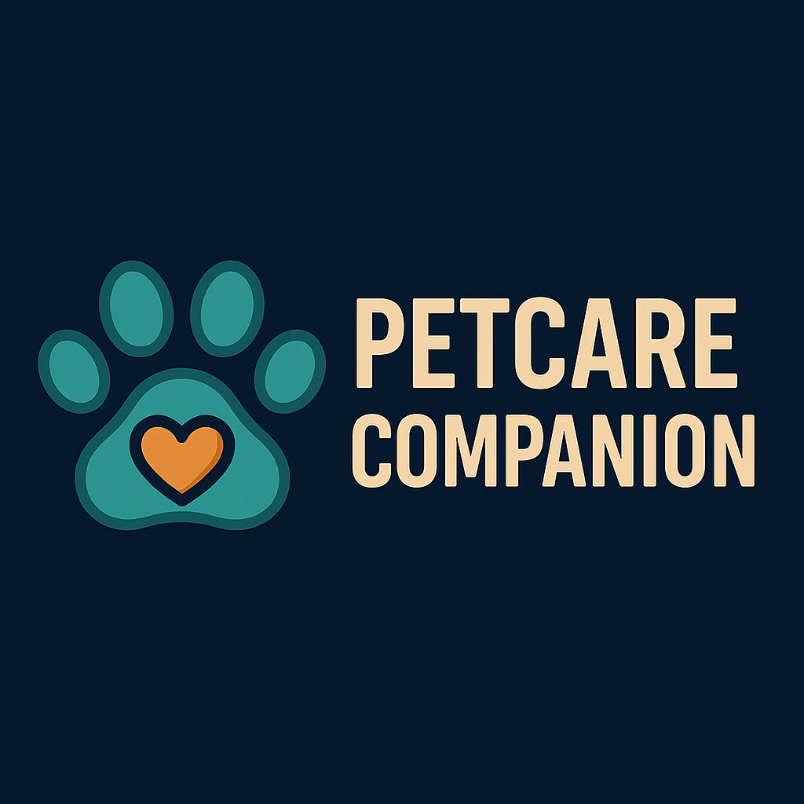
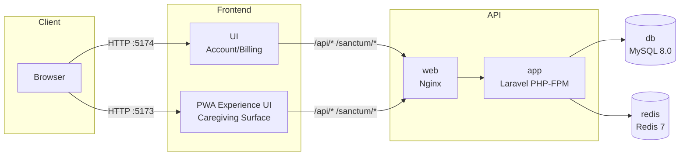

# PetCare Companion

**Status:** Public portfolio / educational reference project

PetCare Companion is a Dockerized Laravel + React monorepo demonstrating API-first application architecture, Sanctum authentication, queued workflows, uploads, CI/CD, and multi-surface frontend development.

It uses a lightweight pet/caregiving domain as the example product surface, but the main purpose of the repo is to demonstrate maintainable full-stack application structure.

## What it demonstrates

- Laravel API architecture with service-oriented boundaries
- Sanctum-based authentication
- Docker Compose development workflows
- MySQL + Redis-backed application services
- React/Vite frontend surfaces
- CI image builds and deployment-oriented repository structure

## Table of Contents

1. [Overview](#overview)
2. [Architecture at a Glance](#architecture-at-a-glance)
3. [Repository Map](#repository-map)
4. [Local Development](#local-development)
5. [Common Workflows](#common-workflows)
6. [Documentation](#documentation)
7. [Production Deployment](#production-deployment)

## Overview

- **Goal:** Demonstrate a clean Laravel 12 API paired with dedicated UI + PWA frontends.
- **Scope:** Lightweight caregiver/activity tracker with uploads, queues, and Docker orchestration.
- **Audience:** Developers exploring Laravel + React best practices (PSR-12, typed services,
  CI-ready setup).
- **Environments:** Development compose stack, staging (`deploy/staging`), and production
  (`deploy/production`).

## Architecture at a Glance

### Services

- **app** — Laravel PHP-FPM container (path: `src/`)
- **web** — Nginx frontend for the Laravel API (port 8080 → 80 in container)
- **pwa** — Vite dev server for the caregiving PWA (development only)
- **ui** — Vite dev server for the account/billing UI (development only)
- **db** — MySQL 8 with persistent volume
- **redis** — Redis 7 for cache + queues
- **worker / scheduler / horizon** — Optional queue consumers

### Ports (development defaults)

- API via Nginx: `http://localhost:8080`
- PWA (Vite): `http://localhost:5173`
- UI (Vite): `http://localhost:5174`
- MySQL: `localhost:3307`
- Redis: `localhost:6379`

## Repository Map

```mermaid
graph LR
  subgraph Client
    A[Browser]
  end

  subgraph Frontend
    U[UI<br/>Account/Billing]
    X[PWA Experience UI<br/>Caregiving Surface]
  end

  subgraph API
    W[web<br/>Nginx]
    P[app<br/>Laravel PHP-FPM]
  end

  D[(db<br/>MySQL 8.0)]
  R[(redis<br/>Redis 7)]

  A -->|HTTP :5174| U
  A -->|HTTP :5173| X
  U -->|/api/* /sanctum/*| W
  X -->|/api/* /sanctum/*| W
  W --> P
  P --> D
  P --> R
```

## Local Development

1. Copy envs: `cp .env.example .env`
2. Start stack: `docker compose up -d`
3. Generate key: `docker compose exec app php artisan key:generate`
4. Migrate + seed: `docker compose exec app php artisan migrate --seed`
5. Visit the PWA at `http://localhost:5173` (caregiving workflows) and the UI at
   `http://localhost:5174` (account/billing). The API lives at `http://localhost:8080`.

**Notes**

- Shared uploads: the default compose file mounts `storage/app/public` between `app` and `web`, and
  `/storage/*` is proxied automatically.
- Laravel commands must run via `docker compose exec app php artisan <cmd>` to keep parity with CI.
- Queue/scheduler/horizon containers are optional; enable them when experimenting with Redis queues.
- The UI (`src/ui`) is scoped to account, billing, and admin flows; the caregiving PWA (`src/pwa`)
  owns daily caregiver experiences.

## Common Workflows

### Uploads & Storage

- Upload endpoint: `POST /api/uploads` (authenticated) accepts images/MP4/WebM ≤10 MB.
- URLs resolve through `/storage` using the shared Docker volume; React uses `VITE_ASSET_BASE`
  (default `/storage`). See `docs/architecture.md` → Shared Storage section for diagrams and
  directory conventions.

### Authentication

- Sanctum cookie-based flow with CSRF handling under `src/pwa/src/api`. Configure `APP_URL`,
  `FRONTEND_URL`, `SESSION_DOMAIN`, and `SANCTUM_STATEFUL_DOMAINS` for your environment.
- Refer to `docs/architecture.md` → Auth Flow for the full sequence diagram and edge cases.

### Queues & Cache

- Redis powers cache + queue drivers by default (`CACHE_DRIVER=redis`, `QUEUE_CONNECTION=redis`).
- Worker containers live in compose; for Horizon enable the `horizon` service and follow the install
  steps documented in `docs/architecture.md`.

## Documentation

| Topic                   | Location                           | Notes                                |
| ----------------------- | ---------------------------------- | ------------------------------------ |
| API / Laravel           | `src/README.md`                    | Artisan, tests, features             |
| UI                      | `src/ui/README.md`                 | Account/billing workspace guidance   |
| PWA Experience UI       | `src/pwa/README.md`                | Caregiving workflows + Vite scripts  |
| Architecture & diagrams | `docs/architecture.md`             | Storage, auth, queue deep dives      |
| Docker / CI             | `docs/CI_CD_SETUP.md`, `DOCKER.md` | Image build strategy, Compose tips   |
| Demo workflow           | `docs/demo-scenario.md`            | End-to-end caregiver + activity flow |
| Production deployment   | `docs/production-deployment.md`    | Env checklist, troubleshooting       |
| Contributing            | `CONTRIBUTING.md`                  | Guidelines for contributors          |

## Production Deployment

- Production compose and helper scripts live in `deploy/production/`.
- Containers expect external MySQL + Redis and prebuilt images from GHCR.
- Start with `docker compose -f deploy/production/docker-compose.yml pull` followed by `up -d`, run
  migrations via `exec app php artisan migrate --force`, then warm caches as needed.
- Detailed environment variable requirements, manual deployment checklist, troubleshooting tips,
  backup plan, and monitoring suggestions are documented in
  [`docs/production-deployment.md`](docs/production-deployment.md).

### Image Tags

- Development: `ghcr.io/slightlyprivate/petcare-companion-{service}:dev-{shortsha}`
- Staging: `ghcr.io/slightlyprivate/petcare-companion-{service}:staging-{version}`
- Production: `ghcr.io/slightlyprivate/petcare-companion-{service}:release-{version}`

Services include: `app`, `web`, `ui`, `pwa`
