# PetCare Companion — Monorepo

A lightweight, educational monorepo demonstrating a Laravel API with a React UI, containerized with
Docker Compose.

## Overview

- Purpose: Showcase clean API design and a modern UI with Laravel Sanctum authentication.
- Audience: Developers exploring Laravel + Vite/React with Docker.
- Scope: Non-production, minimal footprint, no secrets committed.

## Services

- api: Laravel 12 application (path: `src/`), served behind Nginx.
- web: Nginx reverse proxy for the Laravel API (port 8080 → 80 in container).
- ui: Vite dev server with HMR for the React UI (development only).
- db: MySQL 8.0 with persistent volume.
- redis: Redis 7 for cache/queue experimentation.

## Repository Map

```mermaid
graph LR
  subgraph Client
    A[Browser]
  end

  subgraph Frontend
    F[frontend-ui<br/>Vite + React UI]
  end

  subgraph API
    W[web<br/>Nginx]
    P[app<br/>Laravel PHP-FPM]
  end

  D[(db<br/>MySQL 8.0)]
  R[(redis<br/>Redis 7)]

  A -->|HTTP :5173| F
  F -->|/api/* /sanctum/*| W
  W --> P
  P --> D
  P --> R
```



## Quick Start (Development)

- Copy env: `cp .env.example .env`
- Start dev stack: `docker compose -f docker-compose.dev.yml up`
- Generate app key: `docker compose -f docker-compose.dev.yml exec app php artisan key:generate`
- Migrate + seed:
  `docker compose -f docker-compose.dev.yml exec app php artisan migrate && docker compose -f docker-compose.dev.yml exec app php artisan db:seed`

## Ports

- API: `http://localhost:8080`
- UI (Vite dev server): `http://localhost:5173`
- MySQL: `localhost:3307`
- Redis: `localhost:6379`

## Dev Notes

- Laravel commands: `docker-compose exec app php artisan <cmd>`

### Queue/Cache with Redis (Dev)

- `.env` now defaults to Redis: `CACHE_DRIVER=redis`, `QUEUE_CONNECTION=redis` with
  `REDIS_HOST=redis`.
- PHP image includes `phpredis` extension (installed via PECL in `docker/app.Dockerfile`).
- Workers still run as a separate service, but you can use Horizon for dashboarding.

### Horizon (Optional)

- Compose includes a `horizon` service which can run `php artisan horizon`.
- Rebuild PHP images to enable required extensions (`pcntl`, `posix`, `redis`):
  - `docker compose -f docker-compose.dev.yml build app worker scheduler horizon`
- Enable Horizon runtime:
  - Edit `docker-compose.dev.yml` and set `ENABLE_HORIZON: "true"` under the `horizon` service.
- Install Horizon before enabling it:
  - `docker compose -f docker-compose.dev.yml exec app bash -lc "composer require laravel/horizon:^5.23 && php artisan horizon:install && php artisan migrate"`
- Access dashboard at `/horizon` (served via the `web` service).
- If you see "Command \"horizon\" is not defined", ensure you've run the composer and artisan steps
  above, or keep `ENABLE_HORIZON` set to `false` until installation is complete.
- In production, run Horizon as its own process and secure the dashboard behind auth or IP
  allowlists.

### Code Formatting (Prettier)

- Config lives at the repo root: `prettier.config.cjs` and `.prettierignore`.
- UI:
  - Install deps (first run): `cd src/ui && npm install`
  - Format: `npm run format`
  - Check: `npm run format:check`
- In containers:
  - UI (frontend-ui): `docker compose -f docker-compose.dev.yml exec ui sh -lc "npm run format"`

### Pre-commit Hook (Husky)

- Install root dev deps once: `npm install` (at repo root). This runs `husky install` via `prepare`.
- Husky hook: `.husky/pre-commit` uses `lint-staged` to run Prettier only on staged files.
- Manual formatting across both projects: `npm run format` (root) or check `npm run format:check`.

### Dev Compose (Single Stack)

- Use `docker-compose.dev.yml` for development. It includes: Laravel (app), Nginx (web), MySQL (db),
  Redis (redis), Queue worker, Scheduler, and Vite UI (frontend-ui) with live reload.
- UI (Vite HMR): <http://localhost:5173>
- API (Nginx → PHP-FPM): <http://localhost:8080>

## Auth & Cookies

- Flow: The React UI authenticates with Laravel using OTP login. Laravel Sanctum manages
  session-based authentication using cookies. The UI makes direct API calls to Laravel endpoints.
- CSRF: Laravel Sanctum provides CSRF protection via `/sanctum/csrf-cookie`. The UI fetches this
  endpoint to get the XSRF-TOKEN cookie, which is then sent as the `X-XSRF-TOKEN` header on mutating
  requests.
- Logout: `POST /api/auth/logout` clears the session/cookies and revokes the current Sanctum token
  in Laravel.
- Cookies: In production, ensure `SESSION_SECURE_COOKIE=true` in Laravel's `.env` and configure CORS
  appropriately for cross-origin requests.

  **Laravel production config references:**
  - **CORS:** Edit `config/cors.php` to allow your UI domain:
    ```php
    // config/cors.php
    return [
        'paths' => ['api/*', 'sanctum/csrf-cookie'],
        'allowed_origins' => ['https://your-ui-domain.com'],
        'supports_credentials' => true,
    ];
    ```
  - **Sanctum domains:** Edit `SANCTUM_STATEFUL_DOMAINS` in `.env` to include your UI domain:
    ```env
    SANCTUM_STATEFUL_DOMAINS=your-ui-domain.com
    ```
  - **Session settings:** In `.env`, ensure cookies are secure and same-site is set for
    cross-origin:
    ```env
    SESSION_SECURE_COOKIE=true
    SESSION_SAME_SITE=lax
    ```
  - See also: `config/session.php` for session driver and cookie settings.

## Production Compose (Reference)

- `docker-compose.yml` is production-oriented and references prebuilt images (no bind mounts).
  DB/Redis are expected to be external; set connection variables in `.env`.
- Not used during development; build/publish images before using it.
- The UI should be built and served as static files via a web server (e.g., Nginx) or CDN.
- Configure CORS in Laravel to allow requests from your UI domain.

Environment wiring (UI)

- UI build-time vars (Vite):
  - `VITE_API_BASE` (default `/api`): required in production builds. Set to your Laravel API base
    URL.
  - `VITE_API_PROXY_TARGET`: dev-only, points Vite's dev proxy at the Laravel backend (e.g.,
    `http://web`).

## Documentation

- API (Laravel): `src/README.md`
- UI (Vite + React): `src/ui/README.md`
- Architecture: `docs/architecture.md`
- Postman: `src/storage/app/private/scribe/collection.json`

## CI

- UI image build/push: `.github/workflows/ui.yml` (pushes to GHCR)
