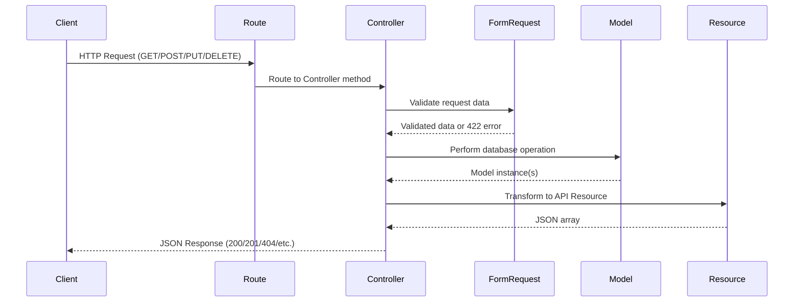
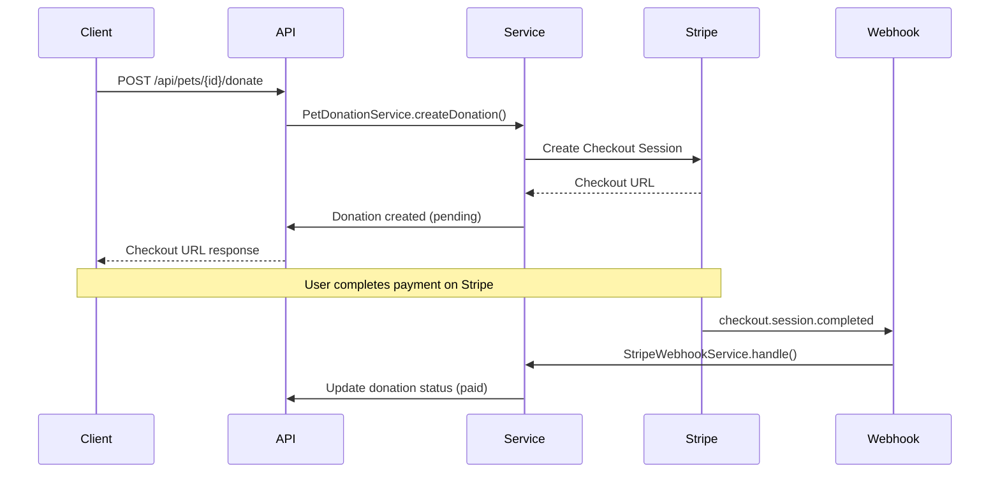
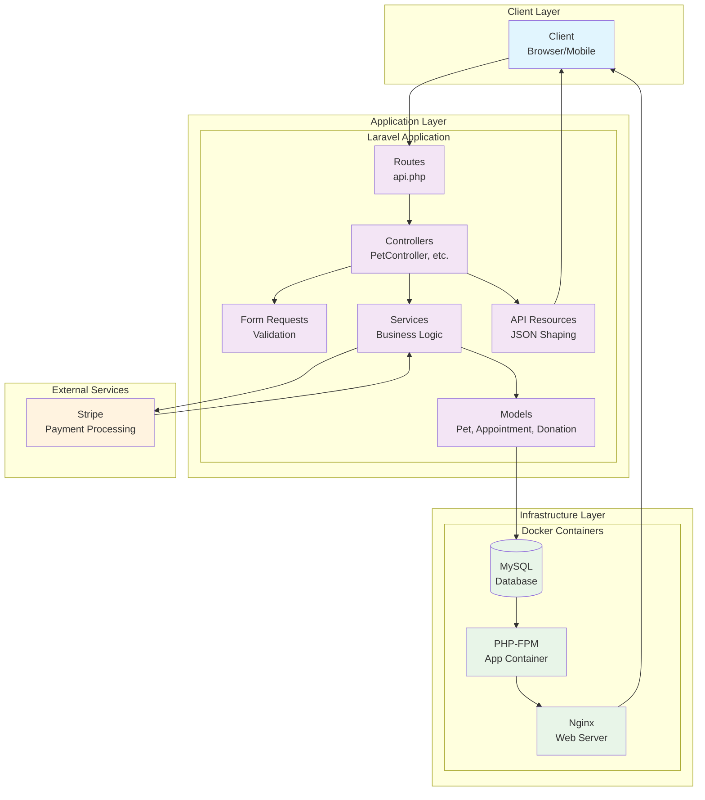

# PetCare Companion — Architecture Overview

## Context

This document explains the system architecture and design decisions for **PetCare Companion**, a Laravel + MySQL micro-app created to demonstrate modern PHP engineering practices. It reflects a focus on maintainability, clarity, and proper MVC separation in a Dockerized environment.

## Key Points

- **Domain:** Manage pets, appointments, and donations (1→many relationships).
- **Primary Goal:** Demonstrate production-quality Laravel patterns with payment integration in a compact, testable API.
- **Architecture Style:** MVC + REST, with clear validation, resources, service layer, and comprehensive test coverage.
- **Environment:** Containerized PHP-FPM + Nginx + MySQL stack using Docker Compose.
- **Authorization:** Dual-role system (standard user vs. system admin) enforced through Laravel policies.
- **Payment Processing:** Stripe integration using Laravel Cashier for donation management.

## Application Layers

### 1. Routing Layer

- Routes defined in `routes/api.php`.
- API routes use `Route::apiResource` for standard CRUD structure.
- Namespaced controllers follow Laravel conventions under `App\Http\Controllers`.

### 2. Controller Layer

- Controllers act as orchestrators—validate, call model operations, and return API resources.
- No business logic directly in controllers; heavy lifting happens in models or services.

### 3. Service Layer

- Business logic separated into service classes (e.g., `PetDonationService`, `StripeWebhookService`).
- Services handle complex operations like Stripe payment processing and webhook handling.
- Controllers remain thin by delegating business logic to services.

### 4. Validation Layer

- Separate Form Request classes handle validation rules (`StorePetRequest`, `StoreAppointmentRequest`, `StoreDonationRequest`).
- Ensures input sanitation and standardized 422 responses on validation failure.

### 5. Authorization Layer

- Role information stored on the `users.role` column backed by the `App\Enums\UserRole` enum.
- `AuthServiceProvider` registers policies for `User` and `Pet` models.
- Policies grant owners access to their own resources while administrators (`UserRole::ADMIN`) receive full visibility and control.
- Feature tests cover both privileged and non-privileged scenarios to prevent regressions.

### 6. Model Layer

- Eloquent ORM manages persistence.
- Models (`Pet`, `Appointment`, `Donation`) define relationships and `$fillable` fields.
- Database enforced with foreign key constraints and cascading deletes for child records.
- Donation model includes UUID primary keys and status management methods.

### 7. Resource Layer

- Laravel API Resources (`PetResource`, `AppointmentResource`) shape consistent JSON output.
- Optional includes supported (e.g., `/api/pets/1?include=appointments`).
- JSON responses structured for readability and machine consumption.

### 8. Payment Layer

- **Stripe Integration**: Laravel Cashier provides seamless Stripe payment processing.
- **Donation System**: Users can donate to pets with amounts between $1-$10,000.
- **Webhook Processing**: Real-time payment status updates via Stripe webhooks.
- **Status Management**: Donations track states (pending, paid, failed) with timestamps.

### 9. Database Layer

- MySQL 8 used for persistence, with tables for pets, appointments, and donations.
- Migration-based schema evolution.
- Seeder files provide sample data for demonstration and testing.
- Relationships:
  - `Pet` hasMany `Appointment`
  - `Pet` hasMany `Donation`
  - `Appointment` belongsTo `Pet`
  - `Donation` belongsTo `Pet` and `User`
- Laravel Cashier tables for subscription and customer management.

### 10. Testing Layer

- Feature tests validate CRUD flows, payment processing, and response formats.
- Comprehensive donation API testing including validation, authentication, and status management.
- Tests run in isolated SQLite memory or test database through Docker.
- Target coverage: successful CRUD paths + payment flows + validation failure cases.

### 11. Presentation Layer (Optional)

- Minimal Blade-based UI built with Bootstrap 5.
- Provides quick view of pets and appointments; not core to the evaluation criteria.

### 12. Infrastructure Layer

- Docker Compose orchestrates three services:
  - **app** (PHP-FPM)
  - **web** (Nginx)
  - **db** (MySQL)
- Each container runs minimal and reproducible; rebuilds produce identical results.
- Local volume mounts sync code for immediate development feedback.

## Security and Configuration

- `.env` defines app, database, and Stripe configuration.
- `.env.example` stored for reproducibility.
- CSRF enabled for Blade routes; REST endpoints expect token-based or stateless access.
- Authorization checks use Laravel policies invoked from controllers (`authorize` helpers) to protect resource endpoints.
- Stripe webhook signature verification ensures payment security.
- Sensitive data (like DB credentials and Stripe keys) excluded from version control.

## Performance and Maintainability

- Pagination on listing endpoints.
- Eager loading to reduce N+1 queries.
- PSR-12 formatting enforced.
- Composer autoload optimization enabled for deployment.

## Decisions

- Laravel selected for rapid development and MVC familiarity.
- Lightweight passwordless auth paired with explicit role-based authorization using policies.
- Laravel Cashier chosen for robust Stripe integration with minimal custom code.
- Docker chosen for parity and environment reproducibility.
- Service layer introduced for complex business logic (payment processing, webhooks).
- Small dataset seeded for deterministic demo output.

## Data Flow Diagrams

### Standard API Request Flow

The following diagram illustrates the typical data flow for a standard API request:

### Payment Processing Flow

The following diagram illustrates the payment processing flow for donations:

This flow ensures proper separation of concerns:

- **Routes** handle URL mapping
- **Controllers** orchestrate the request
- **Form Requests** validate input
- **Services** handle complex business logic
- **Models** handle persistence and basic business logic
- **Resources** format the output

## Architecture Diagram

The following diagram provides a high-level view of the PetCare Companion system architecture:

## Payment System Architecture

The PetCare Companion includes a comprehensive payment system for pet donations using Stripe:

### Components

1. **Donation Model**: Tracks donation records with UUID primary keys, amount in cents, and status management
2. **PetDonationService**: Handles Stripe checkout session creation and donation record management
3. **StripeWebhookService**: Processes Stripe webhooks for payment status updates
4. **Laravel Cashier**: Provides Stripe integration with customer and subscription management capabilities

### Payment Flow

1. **Donation Initiation**: User submits donation amount for a specific pet
2. **Stripe Session Creation**: System creates Stripe checkout session with donation metadata
3. **Payment Processing**: User completes payment on Stripe-hosted checkout page
4. **Webhook Processing**: Stripe sends webhook events for payment completion/failure
5. **Status Update**: System updates donation status based on webhook events

### Security Features

- Webhook signature verification using Stripe's built-in verification
- Donation amount validation ($1-$10,000 range)
- User authentication required for donation creation
- Comprehensive error handling and logging

## References

- Laravel Documentation (Routing, Eloquent, Validation, Resources, Testing)
- Laravel Cashier Documentation (Stripe Integration)
- Stripe API Documentation (Webhooks, Checkout Sessions)
- MySQL 8 Reference Manual (Foreign Keys, Indexes)
- Docker Compose Documentation
