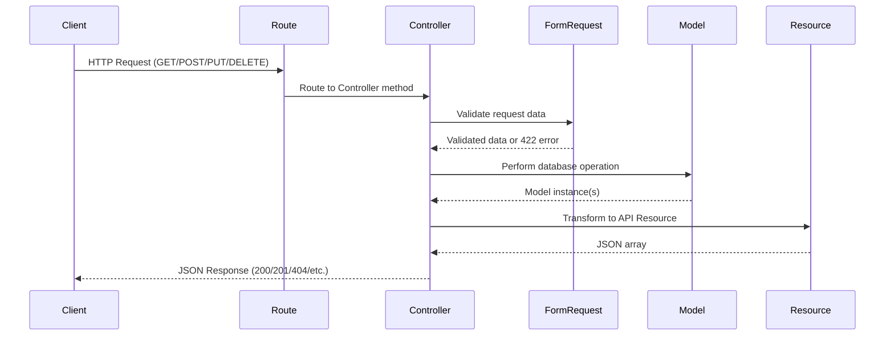
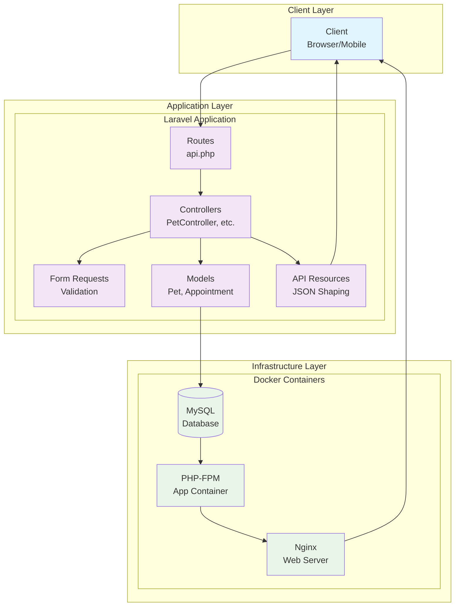

# PetCare Companion — Architecture Overview

## Context

This document explains the system architecture and design decisions for **PetCare Companion**, a Laravel + MySQL micro-app created to demonstrate modern PHP engineering practices. It reflects a focus on maintainability, clarity, and proper MVC separation in a Dockerized environment.

## Key Points

- **Domain:** Manage pets and their appointments (1→many relationship).
- **Primary Goal:** Demonstrate production-quality Laravel patterns in a compact, testable API.
- **Architecture Style:** MVC + REST, with clear validation, resources, and test coverage.
- **Environment:** Containerized PHP-FPM + Nginx + MySQL stack using Docker Compose.

## Application Layers

### 1. Routing Layer

- Routes defined in `routes/api.php`.
- API routes use `Route::apiResource` for standard CRUD structure.
- Namespaced controllers follow Laravel conventions under `App\Http\Controllers`.

### 2. Controller Layer

- Controllers act as orchestrators—validate, call model operations, and return API resources.
- No business logic directly in controllers; heavy lifting happens in models or services.

### 3. Validation Layer

- Separate Form Request classes handle validation rules (`StorePetRequest`, `StoreAppointmentRequest`).
- Ensures input sanitation and standardized 422 responses on validation failure.

### 4. Model Layer

- Eloquent ORM manages persistence.
- Models (`Pet`, `Appointment`) define relationships and `$fillable` fields.
- Database enforced with foreign key constraints and cascading deletes for child records.

### 5. Resource Layer

- Laravel API Resources (`PetResource`, `AppointmentResource`) shape consistent JSON output.
- Optional includes supported (e.g., `/api/pets/1?include=appointments`).
- JSON responses structured for readability and machine consumption.

### 6. Database Layer

- MySQL 8 used for persistence, with tables for pets and appointments.
- Migration-based schema evolution.
- Seeder files provide sample data for demonstration and testing.
- Relationships:
  - `Pet` hasMany `Appointment`
  - `Appointment` belongsTo `Pet`

### 7. Testing Layer

- Feature tests validate CRUD flows and response formats.
- Tests run in isolated SQLite memory or test database through Docker.
- Target coverage: successful CRUD paths + one validation failure case.

### 8. Presentation Layer (Optional)

- Minimal Blade-based UI built with Bootstrap 5.
- Provides quick view of pets and appointments; not core to the evaluation criteria.

### 9. Infrastructure Layer

- Docker Compose orchestrates three services:
  - **app** (PHP-FPM)
  - **web** (Nginx)
  - **db** (MySQL)
- Each container runs minimal and reproducible; rebuilds produce identical results.
- Local volume mounts sync code for immediate development feedback.

## Security and Configuration

- `.env` defines app and database configuration.
- `.env.example` stored for reproducibility.
- CSRF enabled for Blade routes; REST endpoints expect token-based or stateless access.
- Sensitive data (like DB credentials) excluded from version control.

## Performance and Maintainability

- Pagination on listing endpoints.
- Eager loading to reduce N+1 queries.
- PSR-12 formatting enforced.
- Composer autoload optimization enabled for deployment.

## Decisions

- Laravel selected for rapid development and MVC familiarity.
- Focus on API completeness, not authentication or authorization.
- Docker chosen for parity and environment reproducibility.
- Small dataset seeded for deterministic demo output.

## Data Flow Diagram

The following diagram illustrates the typical data flow for an API request in the PetCare Companion application:

This flow ensures proper separation of concerns:

- **Routes** handle URL mapping
- **Controllers** orchestrate the request
- **Form Requests** validate input
- **Models** handle business logic and persistence
- **Resources** format the output

## Architecture Diagram

The following diagram provides a high-level view of the PetCare Companion system architecture:

## References

- Laravel Documentation (Routing, Eloquent, Validation, Resources, Testing)
- MySQL 8 Reference Manual (Foreign Keys, Indexes)
- Docker Compose Documentation
