# PetCare Companion — Architecture Overview

## Context

This document explains the system architecture and design decisions for **PetCare Companion**, a Laravel + MySQL micro-app created to demonstrate modern PHP engineering practices. It reflects a focus on maintainability, clarity, and proper MVC separation in a Dockerized environment.

## Key Points

- **Domain:** Manage pets, appointments, and a virtual gift economy with credit-based gifting.
- **Primary Goal:** Demonstrate production-quality Laravel patterns with Stripe integration for credit purchases in a compact, testable API.
- **Architecture Style:** MVC + REST, with clear validation, resources, service layer, and comprehensive test coverage.
- **Environment:** Containerized PHP-FPM + Nginx + MySQL stack using Docker Compose.
- **Authorization:** Dual-role system (standard user vs. system admin) enforced through Laravel policies.
- **Payment Processing:** Stripe integration for virtual credit purchases and wallet management.

## Application Layers

### 1. Routing Layer

- Routes defined in `routes/api.php`.
- API routes use `Route::apiResource` for standard CRUD structure.
- Namespaced controllers follow Laravel conventions under `App\Http\Controllers`.

### 2. Controller Layer

- Controllers act as orchestrators—validate, call model operations, and return API resources.
- No business logic directly in controllers; heavy lifting happens in models or services.

### 3. Service Layer

- Business logic separated into service classes (e.g., `PetGiftService`, `StripeWebhookService`).
- Services handle complex operations like Stripe payment processing, credit allocation, and gift creation.
- Controllers remain thin by delegating business logic to services.
- Gift-specific services: `GiftService` for receipt generation, `PetGiftService` for gift creation and checkout.

### 4. Validation Layer

- Separate Form Request classes handle validation rules (`StorePetRequest`, `StoreAppointmentRequest`, `StoreGiftRequest`, `ExportGiftReceiptRequest`).
- Ensures input sanitation and standardized 422 responses on validation failure.
- Gift validation includes credit cost range (10-1,000,000 credits) and return URL verification.

### 5. Authorization Layer

- Role information stored on the `users.role` column backed by the `App\Enums\UserRole` enum.
- `AuthServiceProvider` registers policies for `User` and `Pet` models.
- Policies grant owners access to their own resources while administrators (`UserRole::ADMIN`) receive full visibility and control.
- Feature tests cover both privileged and non-privileged scenarios to prevent regressions.

### 6. Model Layer

- Eloquent ORM manages persistence.
- Models (`Pet`, `Appointment`, `Gift`, `Wallet`, `CreditTransaction`) define relationships and `$fillable` fields.
- Database enforced with foreign key constraints and cascading deletes for child records.
- Gift model includes UUID primary keys, credit cost tracking, and status management methods (`markAsPaid()`, `markAsFailed()`).
- Wallet model tracks user credit balances with balance modification methods.
- CreditTransaction model logs all credit movements with type and description tracking.

### 7. Resource Layer

- Laravel API Resources (`PetResource`, `AppointmentResource`) shape consistent JSON output.
- Optional includes supported (e.g., `/api/pets/1?include=appointments`).
- JSON responses structured for readability and machine consumption.

### 8. Payment Layer

- **Stripe Integration**: Laravel Cashier provides seamless Stripe payment processing.
- **Virtual Credits**: Users purchase credits via Stripe (not real currency outside the platform).
- **Wallet System**: Each user has a wallet tracking credit balance.
- **Credit Transactions**: Full logging of all credit purchases and gift expenditures.
- **Gift Processing**: Real-time processing of gift transactions with status management.
- **Status Management**: Credits and gifts track states (pending, paid, failed) with timestamps.

### 9. Database Layer

- MySQL 8 used for persistence, with tables for pets, appointments, gifts, wallets, and credit transactions.
- Migration-based schema evolution.
- Seeder files provide sample data for demonstration and testing.
- Relationships:
  - `Pet` hasMany `Appointment`
  - `Pet` hasMany `Gift`
  - `User` hasMany `Gift`
  - `User` hasOne `Wallet`
  - `Wallet` hasMany `CreditTransaction`
  - `Appointment` belongsTo `Pet`
  - `Gift` belongsTo `Pet` and `User`
- Laravel Cashier tables for subscription and customer management.

### 10. Testing Layer

- Feature tests validate CRUD flows, gift transactions, and response formats.
- Comprehensive gift API testing including validation, authentication, and status management.
- Credit transaction logging and wallet balance verification.
- Tests run in isolated SQLite memory or test database through Docker.
- Target coverage: successful CRUD paths + gift flows + validation failure cases.

### 11. Presentation Layer (Optional)

- Minimal Blade-based UI built with Bootstrap 5.
- Provides quick view of pets and appointments; not core to the evaluation criteria.

### 12. Infrastructure Layer

- Docker Compose orchestrates three services:
  - **app** (PHP-FPM)
  - **web** (Nginx)
  - **db** (MySQL)
- Each container runs minimal and reproducible; rebuilds produce identical results.
- Local volume mounts sync code for immediate development feedback.

## Security and Configuration

- `.env` defines app, database, and Stripe configuration.
- `.env.example` stored for reproducibility.
- CSRF enabled for Blade routes; REST endpoints expect token-based or stateless access.
- Authorization checks use Laravel policies invoked from controllers (`authorize` helpers) to protect resource endpoints.
- Stripe webhook signature verification ensures payment security.
- Sensitive data (like DB credentials and Stripe keys) excluded from version control.

## Performance and Maintainability

- Pagination on listing endpoints.
- Eager loading to reduce N+1 queries.
- PSR-12 formatting enforced.
- Composer autoload optimization enabled for deployment.

## Decisions

- Laravel selected for rapid development and MVC familiarity.
- Lightweight passwordless auth paired with explicit role-based authorization using policies.
- Laravel Cashier chosen for robust Stripe integration with minimal custom code.
- Docker chosen for parity and environment reproducibility.
- Service layer introduced for complex business logic (payment processing, webhooks).
- Small dataset seeded for deterministic demo output.

## Data Flow Diagrams

### Standard API Request Flow

The following diagram illustrates the typical data flow for a standard API request:


### Payment Processing Flow

The following diagram illustrates the payment processing flow for gift purchases:


This flow ensures proper separation of concerns:

- **Routes** handle URL mapping
- **Controllers** orchestrate the request
- **Form Requests** validate input
- **Services** handle complex business logic
- **Models** handle persistence and basic business logic
- **Resources** format the output

## Architecture Diagram

The following diagram provides a high-level view of the PetCare Companion system architecture:


## Gift Economy System Architecture

The PetCare Companion uses a symbolic **gift economy** model. This section details the system architecture, data flow, and design rationale.

### Why Gift Economy Instead of Direct Donations?

The gift economy model provides several advantages:

1. **Platform Control**: Credits are virtual currency tied to the platform, enabling:
   - Controlled supply and value perception
   - Promotional credit allocations
   - Premium gift tiers and rewards
   - Gamification opportunities (leaderboards, achievements)

2. **User Engagement**: Symbolic gifting encourages:
   - More frequent interactions compared to one-time monetary transactions
   - Community participation and social sharing
   - Repeated credit purchases for gift-giving
   - Emotional connection to pets beyond financial contribution

3. **Business Flexibility**: Credit-based system enables:
   - Dynamic pricing adjustments without currency concerns
   - Subscription-based credit packages
   - Time-limited credit incentives

### Core Components

#### 1. Gift Model (`App\Models\Gift`)

**Purpose**: Represents a virtual gift sent from a user to a pet.

**Key Attributes**:

- `id` (UUID): Unique identifier
- `user_id` (FK): Gift sender
- `pet_id` (FK): Gift recipient
- `cost_in_credits` (int): Credit cost (10-1,000,000)
- `stripe_session_id` (string): Stripe checkout session identifier
- `stripe_charge_id` (string): Stripe payment identifier after completion
- `stripe_metadata` (json): Additional Stripe payment metadata
- `status` (enum): pending, paid, failed
- `completed_at` (timestamp): Completion timestamp
- `created_at`, `updated_at` (timestamps)
- `deleted_at` (timestamp): Soft delete tracking

**Methods**:

- `markAsPaid()`: Transitions gift to paid status
- `markAsFailed()`: Transitions gift to failed status
- `scopePaid()`: Query scope for completed gifts
- `scopePending()`: Query scope for pending gifts

**Relationships**:

- `BelongsTo User`: Gift sender
- `BelongsTo Pet`: Gift recipient

**Traits**:

- `HasUuids`: UUID primary key generation
- `LogsActivity`: Audit logging via Spatie Activity Log
- `SoftDeletes`: Logical deletion support

#### 2. Wallet Model (`App\Models\Wallet`)

**Purpose**: Manages user credit balance and wallet operations.

**Key Attributes**:

- `id` (UUID): Unique identifier
- `user_id` (FK): Wallet owner
- `balance_credits` (int): Current credit balance
- `created_at`, `updated_at` (timestamps)

**Methods**:

- `incrementBalance(int $amount)`: Add credits to wallet
- `decrementBalance(int $amount)`: Deduct credits from wallet
- `getAvailableCredits()`: Retrieve current balance

**Relationships**:

- `BelongsTo User`: Wallet owner
- `HasMany CreditTransaction`: Transaction history

**Traits**:

- `HasUuids`: UUID primary key generation
- `LogsActivity`: Audit logging

#### 3. CreditTransaction Model (`App\Models\CreditTransaction`)

**Purpose**: Logs all credit movements for audit trail and user history.

**Key Attributes**:

- `id` (UUID): Unique identifier
- `wallet_id` (FK): Associated wallet
- `amount_credits` (int): Transaction amount
- `type` (enum): purchase, gift_sent, gift_received, refund
- `description` (string): Human-readable description
- `reference_id` (string): Reference to source (stripe_charge_id, gift_id)
- `created_at`, `updated_at` (timestamps)

**Relationships**:

- `BelongsTo Wallet`: Transaction owner's wallet

**Traits**:

- `HasUuids`: UUID primary key generation
- `LogsActivity`: Audit logging

#### 4. PetGiftService (`App\Services\Pet\PetGiftService`)

**Purpose**: Orchestrates gift creation and Stripe checkout session management.

**Key Methods**:

- `createGift(User $user, Pet $pet, int $costInCredits, string $returnUrl)`: Creates gift record and returns checkout session URL
- `createStripeCheckoutSession(Gift $gift)`: Generates Stripe Checkout session
- `generateUniqueId()`: Creates unique gift identifier for Stripe metadata

**Logic Flow**:

1. Validates credit cost is within acceptable range (10-1,000,000 credits)
2. Creates Gift record with status = 'pending'
3. Generates Stripe Checkout Session configured for credit purchase
4. Returns checkout URL to client
5. Awaits webhook confirmation

#### 5. GiftService (`App\Services\Gift\GiftService`)

**Purpose**: Handles gift receipt generation and PDF export.

**Key Methods**:

- `generateReceiptData(Gift $gift)`: Compiles gift metadata for receipt
- `exportReceiptAsFile(Gift $gift)`: Generates and returns PDF receipt

**Data Included in Receipt**:

- Gift ID and timestamp
- Sender name and email
- Pet name and ID
- Credit cost and description
- Payment status

#### 6. StripeWebhookService (`App\Services\Stripe\StripeWebhookService`)

**Purpose**: Processes Stripe webhook events and updates system state.

**Key Events Handled**:

- `checkout.session.completed`: Payment confirmed, update gift status and allocate credits
- `charge.refunded`: Refund event, deduct credits from wallet and mark gift as failed

**Webhook Processing Logic**:

1. Verify webhook signature using Stripe's key
2. Retrieve webhook data and extract reference IDs
3. Find corresponding Gift record
4. Update Gift status (pending → paid/failed)
5. Create or remove CreditTransaction entries
6. Update user Wallet balance
7. Log all operations for audit trail

#### 7. Controllers

**GiftController** (`App\Http\Controllers\Gift\GiftController`):

- `exportReceipt(ExportGiftReceiptRequest $request, Gift $gift)`: Exports gift receipt as PDF (200 OK)

**PetGiftController** (`App\Http\Controllers\Pet\PetGiftController`):

- `store(StoreGiftRequest $request, Pet $pet)`: Creates gift for pet (201 Created)
  - Returns checkout URL for client-side redirect
  - Validates user authorization via Gate policy
  - Returns error if pet is owned by requester (no self-gifting)

### Complete Gift Purchase and Transaction Flow

```mermaid
sequenceDiagram
    participant User as User<br/>(Client)
    participant App as PetCare API
    participant GiftSvc as PetGiftService
    participant Stripe as Stripe<br/>Checkout
    participant StripeAPI as Stripe<br/>Webhooks
    participant WebhookSvc as StripeWebhookService
    participant Wallet as Wallet/Credit<br/>System

    User->>App: 1. POST /api/pets/{id}/gifts<br/>(cost_in_credits: 100)
    App->>GiftSvc: Validate & Create Gift Record
    GiftSvc->>App: Gift ID, Checkout URL
    App->>User: 201 + Checkout URL
    Note over User,Stripe: User redirected to Stripe Checkout
    User->>Stripe: 2. Complete Payment Form
    Stripe->>User: 3. Redirect to return_url
    Note over StripeAPI,Wallet: Asynchronous Processing
    Stripe->>StripeAPI: 4. checkout.session.completed<br/>(webhook)
    StripeAPI->>WebhookSvc: Event with charge data
    WebhookSvc->>App: Verify gift exists
    WebhookSvc->>App: Update Gift status → paid
    WebhookSvc->>Wallet: Allocate 100 credits<br/>to user wallet
    Wallet->>App: Create CreditTransaction<br/>(type: purchase)
    WebhookSvc->>App: Log transaction
    StripeAPI->>StripeAPI: 5. Webhook acknowledged
```



### Credit Allocation and Validation

**Validation Rules** (StoreGiftRequest):

- `cost_in_credits` must be integer between 10 and 1,000,000
- `return_url` must be valid HTTPS URL for redirect after payment
- Pet must exist and not be owned by requester
- User must be authenticated

**Credit Cost Semantics**:

- **10-100 credits**: Small tokens of appreciation (common daily gifts)
- **100-1,000 credits**: Substantial gestures of support (weekly/monthly contributors)
- **1,000-1,000,000 credits**: Premium tiers, special occasions, or bulk contributions (future feature)

**Wallet Operations**:

1. Purchase: Credits added to wallet via webhook
2. Gift Sent: Credits remain in wallet until recipient claims (future enhancement)
3. Refunds: Wallet decremented if payment is refunded

### Transaction Atomicity and Consistency

**State Consistency Guarantees**:

1. Gift record created with `status = 'pending'` before Stripe session creation
2. Webhook verification ensures only authentic Stripe events processed
3. Database transactions wrap Gift status updates and CreditTransaction creation
4. Idempotency: Duplicate webhook events checked via `reference_id` lookup
5. Soft deletes preserve historical data while allowing logical removal

**Error Handling**:

- Stripe checkout session creation failures → Gift remains pending, user retries
- Webhook processing failures → Logged and retried via Stripe webhook mechanism
- Credit allocation failures → Webhook nacked, Stripe retries delivery
- Concurrent requests → Database constraints prevent double-processing

### Database Schema and Relationships

**Tables**:

- `gifts`: Gift records with cost_in_credits, status, timestamps
- `wallets`: User credit balances
- `credit_transactions`: Transaction log
- `users`: User records (unchanged)
- `pets`: Pet records (unchanged)

**Foreign Key Relationships**:

- `gifts.user_id` → `users.id` (CASCADE DELETE)
- `gifts.pet_id` → `pets.id` (CASCADE DELETE)
- `wallets.user_id` → `users.id` (CASCADE DELETE)
- `credit_transactions.wallet_id` → `wallets.id` (CASCADE DELETE)

**Indexes**:

- `gifts(user_id, status)`: Efficient user gift queries
- `gifts(pet_id)`: Pet gift history lookup
- `credit_transactions(wallet_id, created_at)`: Transaction history pagination

### Security and Validation

**Stripe Webhook Security**:

- Webhook signature verified using Stripe API key before processing
- Only events from Stripe's IP address accepted (in production)
- Webhook handler accepts no user input; all data from Stripe

**Authorization Checks**:

- Gift receipt export: User must be gift sender or pet owner (PolicyAuthorizationException)
- Gift creation: User cannot send gift to own pet (validation exception)
- Wallet access: Users can only view their own wallet (policy)

**Credit Validation**:

- Cost range enforced in StoreGiftRequest (10-1,000,000 credits)
- No negative credit amounts accepted
- Wallet balance cannot go negative (future enhancement: pending gift holds)

**Audit Logging**:

- All Gift state changes logged via Spatie Activity Log
- All CreditTransaction entries immutable once created
- All Wallet modifications logged
- Webhook events logged with full payload

### API Endpoints

**Gift Creation**:

```http
POST /api/pets/{pet}/gifts
Content-Type: application/json
Authorization: Bearer {token}

{
  "cost_in_credits": 100,
  "return_url": "https://app.example.com/gift-success"
}
```

Response (201 Created):

```json
{
  "id": "550e8400-e29b-41d4-a716-446655440000",
  "user_id": "user-uuid",
  "pet_id": "pet-uuid",
  "cost_in_credits": 100,
  "status": "pending",
  "checkout_url": "https://checkout.stripe.com/...",
  "created_at": "2025-11-14T12:34:56Z"
}
```

**Receipt Export**:

```http
GET /api/gifts/{gift}/receipt
Authorization: Bearer {token}
```

Response (200 OK):

Returns PDF file with gift receipt details.

### Performance Considerations

**Query Optimization**:

- `with(['user', 'pet'])` eager loading in controllers
- Pagination on gift history endpoints (15 per page)
- Indexed lookups on `user_id`, `pet_id`, `status` for filtering

**Webhook Processing**:

- Async webhook processing (queued jobs in production)
- Webhook retries handled by Stripe (exponential backoff)
- Rate limiting: 60 requests/minute per user (RateLimitHelper)

**Credit Calculation**:

- Wallet balance calculated via SUM of transactions (cached in future)
- Transaction history stored with immutable audit trail
- No recalculation of balances; transactions are source of truth

### Future Extensibility

**Premium Gift Tiers** (Phase 2):

- Standard gifts: 10-100 credits (current)
- Premium gifts: 100-1,000 credits (animated, collectable)
- Legendary gifts: 1,000-1,000,000 credits (exclusive, limited edition)

**Leaderboards**:

- "Top Gift Givers" ranked by total credits spent monthly
- "Most Loved Pets" ranked by total gifts received
- Achievements for milestone gift counts

**Credit Marketplace** (Phase 3):

- User-to-user credit transfers
- Gift marketplace for trading/selling premiums
- Time-limited promotional credits
- Bulk credit packages with discounts

**Notifications**:

- Real-time notifications when pet receives gift
- Email receipts for gift purchases
- Weekly digest of received gifts

## References

- Laravel Documentation (Routing, Eloquent, Validation, Resources, Testing)
- Laravel Cashier Documentation (Stripe Integration)
- Stripe API Documentation (Webhooks, Checkout Sessions)
- MySQL 8 Reference Manual (Foreign Keys, Indexes)
- Docker Compose Documentation
